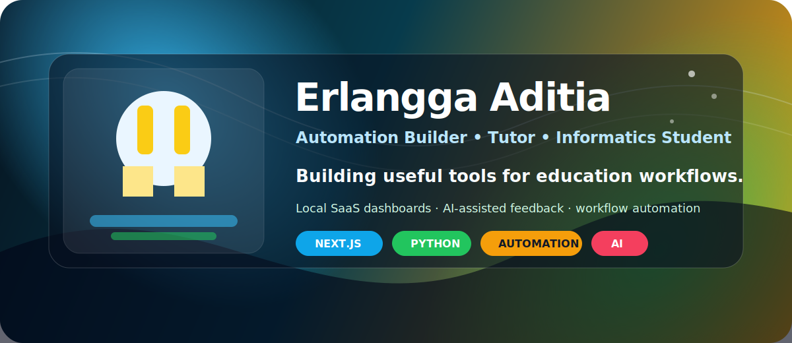

<div align="center">



<br />

<a href="https://www.instagram.com/erladitia/"></a>
<a href="https://www.linkedin.com/in/erladitia14/"></a>


</div>

<br />

<table>
<tr>
<td width="58%" valign="top">

## What I Build

Saya membuat tool kecil yang punya impact besar untuk workflow edukasi, mulai dari dashboard lokal, automation browser, sampai feedback report berbasis AI yang langsung bisa dipakai tutor.

- Mengubah pekerjaan repetitif menjadi proses sekali klik.
- Merapikan data kelas, lesson, feedback, dan PDF report.
- Membuat sistem praktis yang cepat dipakai, bukan cuma demo.

</td>
<td width="42%" valign="top">

## Current Focus

```txt
Dashboard SaaS       █████████░ 90%
Education Automation ████████░░ 80%
AI Feedback Writer   ████████░░ 80%
Frontend Polish      ███████░░░ 70%
```

</td>
</tr>
</table>

## Featured Work

<table>
<tr>
<td width="33%" valign="top">

### SaaS Automation Dashboard
Local control center untuk menjalankan automation pendidikan dari satu tempat.

`Next.js` `TypeScript` `Automation`

</td>
<td width="33%" valign="top">

### Algonova Feedback Writer
Generate feedback singkat, apply ke Monthly Personal, lalu export PDF otomatis.

`AI` `Google Sheets` `PDF`

</td>
<td width="33%" valign="top">

### Kodland Automation Tools
Workflow automation untuk lesson, homework, dan proses tutor harian.

`Python` `Playwright` `Workflow`

</td>
</tr>
</table>

## Toolbox

<div align="center">


</div>

## Snapshot

<div align="center">


</div>

<br />

<div align="center">

### Build less manually. Ship more intentionally.

</div>
